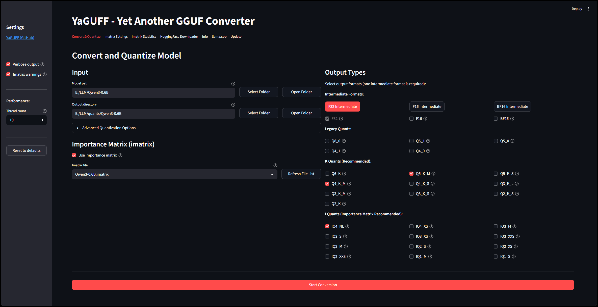

# YaGUFF - Yet Another GGUF Converter

There are simultaneously too many and not enough GGUF converters in the world.

 
(dark mode)
 
## Features

- **[llama.cpp](https://github.com/ggerganov/llama.cpp) under the hood** - so that part works
- **Convert** - safetensors and PyTorch models to GGUF format
- **Quantize** - to multiple formats at once
- **Cross-platform** - works on Windows and Linux (and probably Mac but I'm not testing that)
- **Easy** - auto-installs an environment + llama.cpp + CPU binaries for quantizing
- **Minimal mess** - everything but a settings.json lives in one folder/venv

## Quantization Types

All quantization types from llama.cpp are supported. Choose based on your size/quality tradeoff:

| Type | Size | Quality | Category | Notes |
|------|------|---------|----------|-------|
| **F32** | Largest | Original | Unquantized | Full 32-bit precision |
| **F16** | Large | Near-original | Unquantized | Half precision, minimal quality loss |
| BF16 | Large | Near-original | Unquantized | Brain float 16-bit |
| Q8_0 | Very Large | Excellent | Legacy | Near-original quality, 8-bit |
| Q5_1 | Medium | Good | Legacy | Legacy 5-bit improved |
| Q5_0 | Medium | Good | Legacy | Legacy 5-bit |
| Q4_1 | Small | Fair | Legacy | Legacy 4-bit improved |
| Q4_0 | Small | Fair | Legacy | Legacy 4-bit |
| **Q6_K** | Large | Very High | K-Quant | Near-F16 quality, larger size |
| **Q5_K_M** | Medium | Better | K-Quant | Higher quality with acceptable size |
| Q5_K_S | Medium | Better | K-Quant | 5-bit K small |
| **Q4_K_M** | Small | Good | K-Quant | **Default recommendation** - best balance |
| Q4_K_S | Small | Good | K-Quant | 4-bit K small |
| Q3_K_M | Very Small | Fair | K-Quant | Aggressive compression |
| Q3_K_L | Very Small | Fair | K-Quant | 3-bit K large |
| Q3_K_S | Very Small | Fair | K-Quant | 3-bit K small |
| Q2_K | Tiny | Minimal | K-Quant | Maximum compression |
| Q2_K_S | Tiny | Minimal | K-Quant | 2-bit K small |
| IQ4_NL | Small | Good | I-Quant | 4-bit non-linear (use imatrix) |
| IQ4_XS | Small | Good | I-Quant | 4-bit extra-small (use imatrix) |
| IQ3_M | Very Small | Fair | I-Quant | 3-bit medium (use imatrix) |
| IQ3_S | Very Small | Fair+ | I-Quant | 3.4-bit compression (use imatrix) |
| IQ3_XS | Very Small | Fair | I-Quant | 3-bit extra-small (use imatrix) |
| IQ3_XXS | Very Small | Fair | I-Quant | 3-bit extra-extra-small (use imatrix) |
| IQ2_M | Tiny | Minimal | I-Quant | 2-bit medium (use imatrix) |
| IQ2_S | Tiny | Minimal | I-Quant | 2-bit small (use imatrix) |
| IQ2_XS | Tiny | Minimal | I-Quant | 2-bit extra-small (use imatrix) |
| IQ2_XXS | Tiny | Minimal | I-Quant | 2-bit extra-extra-small (use imatrix) |
| IQ1_M | Extreme | Poor | I-Quant | 1-bit medium, experimental (use imatrix) |
| IQ1_S | Extreme | Poor | I-Quant | 1-bit small, experimental (use imatrix) |


**Quick Guide:**
- Bigger is better (more precision)
- Need omega deluxe quality? Use **F16** or **Q8_0**
- Want decent quality? Use **Q6_K** or **Q5_K_M**
- Just medium? Use **Q4_K_M**
- Want smallest size? Use IQ3_M or IQ2_M with importance matrix

## Installation - Windows

```bash
# Clone the repository
    git clone https://github.com/usrname0/YaGUFF.git
    cd YaGUFF
# Run the launcher script for Windows (runs a setup script if no venv detected):
    run_gui.bat
```

## Installation - Linux

```bash
# Clone the repository
    git clone https://github.com/usrname0/YaGUFF.git
    cd YaGUFF

# If you want to select folders via the gui install tkinter (optional):
    sudo apt install python3-tk      # Ubuntu/Debian
    sudo dnf install python3-tkinter # Fedora/RHEL
    sudo pacman -S tk                # Arch

# Run the launcher script for Linux (runs a setup script if no venv detected):
    ./run_gui.sh
```

## Usage

**Windows:**
- Double-click `run_gui.bat`

**Linux:**
- Use terminal `./run_gui.sh`

The GUI will automatically open in your browser on a free port like: `http://localhost:8501`

## Requirements

- [Python](https://www.python.org/downloads/) 3.8 or higher
- [Git](https://git-scm.com/downloads) 2.20 or higher 

## Troubleshooting

### Out of Memory

For large models, ensure you have enough RAM. You can also:
- Use swap space (if you like pain)
- Close other applications
- Try a smaller model
- Spend a fortune on better hardware

### Conversion is slow

This is normal for large models. The process is CPU-intensive.
- Enable "Verbose output" in settings to see progress
- Adjust "Thread count" in settings (sets the number of CPU cores for the task)
- Be patient - it will finish!

### Other Errors

I tried to prevent wandering into errors without making it too neutered.
- "Incomapatibility warnings" will disable some quants for some models but you can disable this in the settings.
- "Imatrix warnings" will disable smaller quants if you don't select an imatrix option.   You can disable this in the settings (good luck).
- You can "Reset to defaults" in the settings
- If something gets ugly or confusing just delete the folder and re-install!
  
## License

MIT License - see LICENSE file for details

## Credits

- [llama.cpp](https://github.com/ggerganov/llama.cpp) - GGUF format and conversion/quantization tools
- [HuggingFace](https://huggingface.co/) - Model hosting and transformers library
