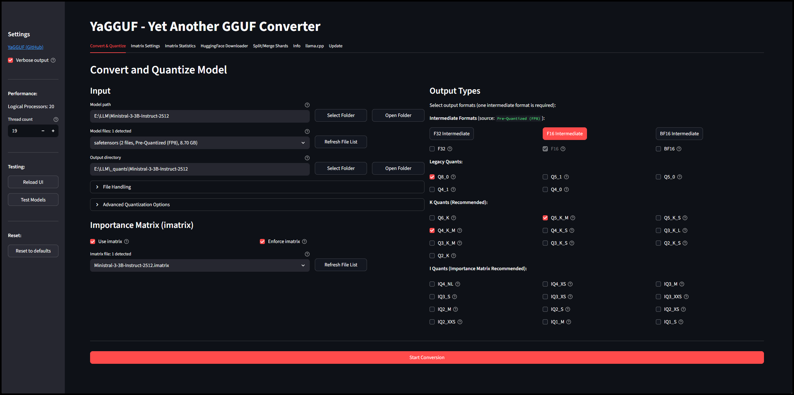

# YaGGUF - Yet Another GGUF Converter

There are simultaneously too many and not enough GGUF converters in the world.

 
[More screenshots](./docs/)

## Features

- **[llama.cpp](https://github.com/ggerganov/llama.cpp) under the hood** - so that part works
- **Download** - automatically download models and their auxiliary files from HuggingFace
- **Convert** - safetensors and PyTorch models to GGUF format
- **Quantize** - to multiple formats at once
- **Cross-platform** - works on Windows and Linux (and probably Mac but untested)
- **Easy** - auto-installs an environment + llama.cpp + CPU binaries for quantizing
- **Flexible** - can use any local llama.cpp repo or binary installation for quantizing
- **Minimal mess** - virtual environment prevents conflicts with your python setup

### Advanced Features

- **Single or split files mode** - Generate single or split files for intermediates and quants
- **Split/Merge Shards** - Split, merge, or resplit GGUF and safetensors files with custom shard sizes
- **Importance Matrix** - Generate or reuse imatrix files for better low-bit quantization (IQ2, IQ3)
- **Imatrix Statistics** - Analyze importance matrix files to view statistics
- **Custom intermediates** - Use existing GGUF files as intermediates for quantization
- **Enhanced dtype detection** - Detects model precision (BF16, F16, etc.) from configs and safetensors headers
- **Model quirks detection** - Handles Mistral format, pre-quantized models, and architecture-specific flags
- **Vision/Multimodal models** - Automatic detection and two-step conversion (text model + `mmproj-*.gguf`)
- **Sentence-transformers** - Auto-detect and include dense modules for embedding models

## Quantization Types

All quantization types from llama.cpp are supported. Choose based on your size/quality tradeoff:

| Type | Size | Quality | Category | Notes |
|------|------|---------|----------|-------|
| **F32** | Largest | Original | Unquantized | Full 32-bit precision |
| **F16** | Large | Near-original | Unquantized | Half precision |
| **BF16** | Large | Near-original | Unquantized | Brain float 16-bit |
| **Q8_0** | Very Large | Excellent | Legacy | Near-original quality |
| Q5_1, Q5_0 | Medium | Good | Legacy | Legacy 5-bit |
| Q4_1, Q4_0 | Small | Fair | Legacy | Legacy 4-bit |
| **Q6_K** | Large | Very High | K-Quant | Near-F16 quality |
| **Q5_K_M** | Medium | Better | K-Quant | Higher quality |
| Q5_K_S | Medium | Better | K-Quant | 5-bit K small |
| **Q4_K_M** | Small | Good | K-Quant | 4-bit K medium |
| Q4_K_S | Small | Good | K-Quant | 4-bit K small |
| Q3_K_L | Very Small | Fair | K-Quant | 3-bit K large |
| Q3_K_M | Very Small | Fair | K-Quant | 3-bit K medium |
| Q3_K_S | Very Small | Fair | K-Quant | 3-bit K small |
| Q2_K | Tiny | Minimal | K-Quant | 2-bit K |
| Q2_K_S | Tiny | Minimal | K-Quant | 2-bit K small |
| **IQ4_NL** | Small | Good | I-Quant | 4-bit non-linear (use imatrix) |
| IQ4_XS | Small | Good | I-Quant | 4-bit extra-small (use imatrix) |
| IQ3_M | Very Small | Fair | I-Quant | 3-bit medium (use imatrix) |
| IQ3_S | Very Small | Fair+ | I-Quant | 3.4-bit (use imatrix) |
| IQ3_XS | Very Small | Fair | I-Quant | 3-bit extra-small (use imatrix) |
| IQ3_XXS | Very Small | Fair | I-Quant | 3-bit extra-extra-small (use imatrix) |
| IQ2_M | Tiny | Minimal | I-Quant | 2-bit medium (use imatrix) |
| IQ2_S | Tiny | Minimal | I-Quant | 2-bit small (use imatrix) |
| IQ2_XS | Tiny | Minimal | I-Quant | 2-bit extra-small (use imatrix) |
| IQ2_XXS | Tiny | Minimal | I-Quant | 2-bit extra-extra-small (use imatrix) |
| IQ1_M | Extreme | Poor | I-Quant | 1-bit medium (use imatrix) |
| IQ1_S | Extreme | Poor | I-Quant | 1-bit small (use imatrix) |


**Quick Guide:**
- Bigger is better (more precision)
- For best quality use **F16** or **Q8_0**
- For decent quality use **Q6_K** or **Q5_K_M**
- Medium quality... Use **Q4_K_M**
- For smallest size use IQ3_M or IQ2_M with importance matrix

## Requirements

- [Python](https://www.python.org/downloads/) 3.8 or higher
- [Git](https://git-scm.com/downloads) 2.20 or higher (if you want the update tab to work)

## Installation - Windows

```bash
# Clone the repository
    git clone https://github.com/usrname0/YaGGUF.git
    cd YaGGUF
# Run the launcher script for Windows (runs a setup script if no venv detected):
    .\run_gui.bat
```

## Installation - Linux

```bash
# If you want to select folders via the gui install tkinter (optional):
    sudo apt install python3-tk      # Ubuntu/Debian
    sudo dnf install python3-tkinter # Fedora/RHEL
    sudo pacman -S tk                # Arch

# Clone the repository
    git clone https://github.com/usrname0/YaGGUF.git
    cd YaGGUF

# Run the launcher script for Linux (runs a setup script if no venv detected):
    ./run_gui.sh
```

## Usage

**Windows:**
- Double-click `.\run_gui.bat`

**Linux:**
- Use terminal `./run_gui.sh`

The GUI will automatically open in your browser on a free port like: `http://localhost:8501`

## License

MIT License - see LICENSE file for details

## Credits

- [llama.cpp](https://github.com/ggerganov/llama.cpp) - GGUF format and conversion/quantization tools
- [HuggingFace](https://huggingface.co/) - Model hosting and transformers library
