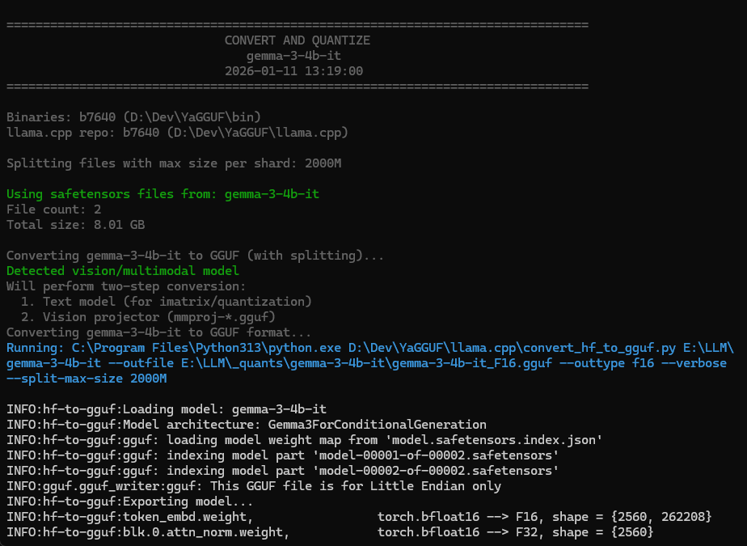

# YaGGUF Screenshots

## Convert & Quantize

## HuggingFace Downloader

## Imatrix Settings

## Imatrix Statistics

## llama.cpp Custom Installation

## Split/Merge Shards

## Resplit Shards

## Terminal Output

## Update Tab

