# YaGGUF Screenshots

## Run GGUF
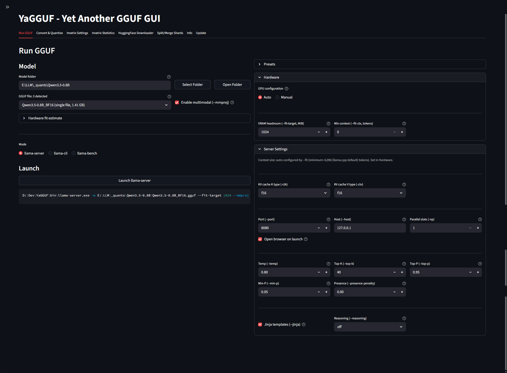

## Run GGUF Expanded Options
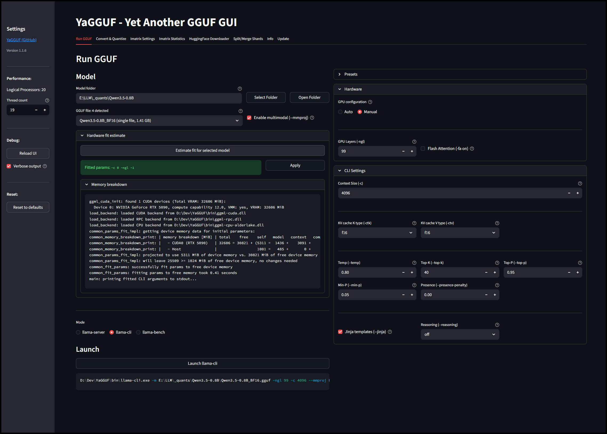

## Convert & Quantize
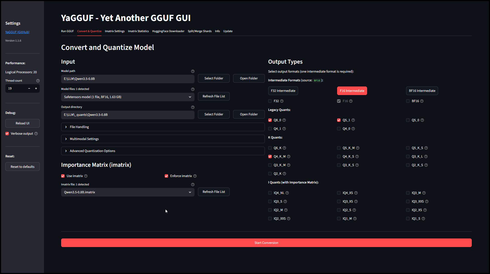

## Convert & Quantize Expanded Options
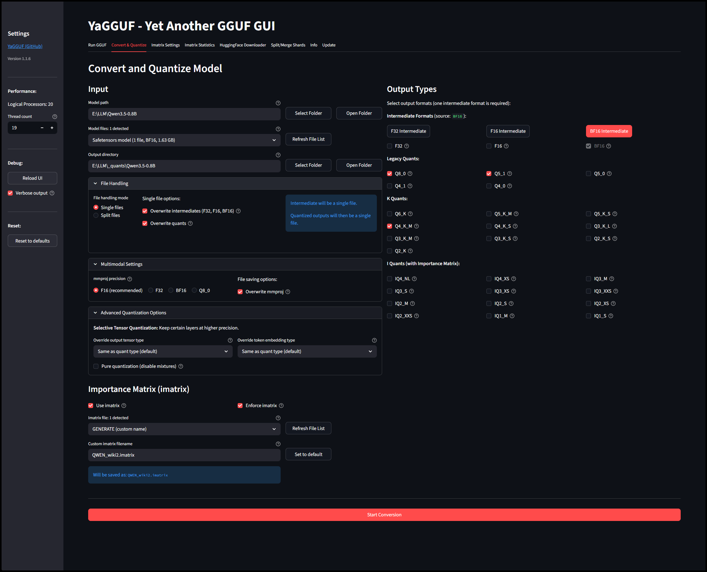

## Quantize Existing Intermediates
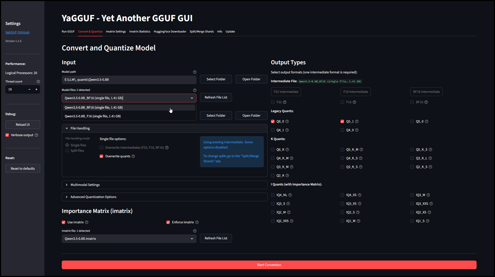

## Imatrix Settings
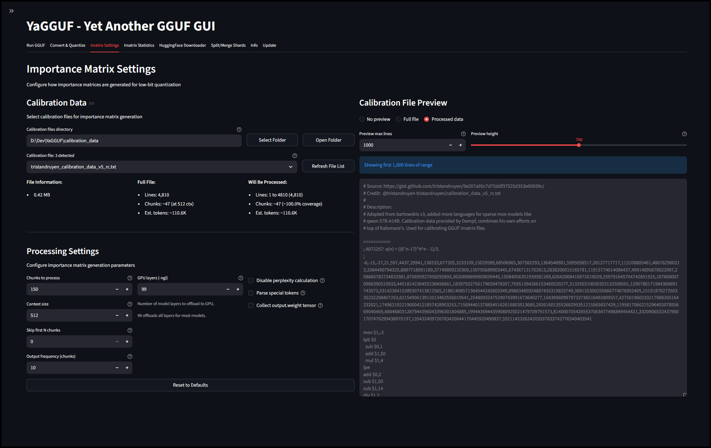

## Imatrix Statistics
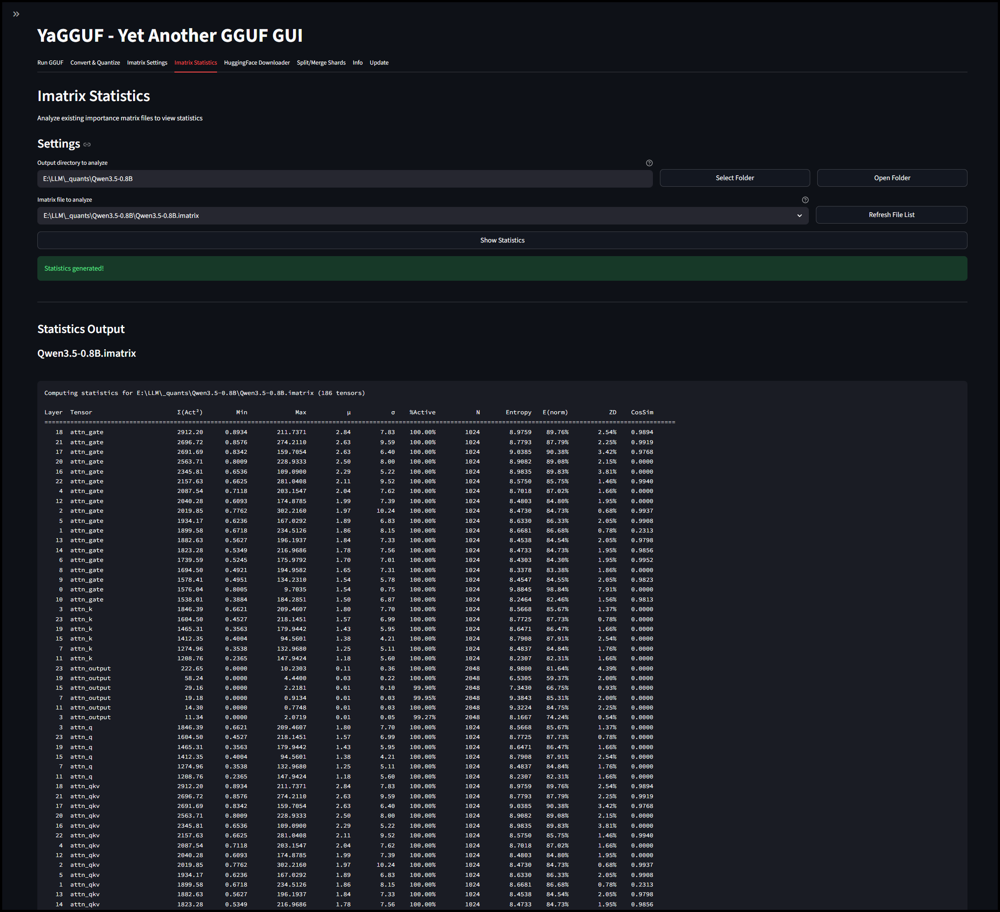

## HuggingFace Downloader
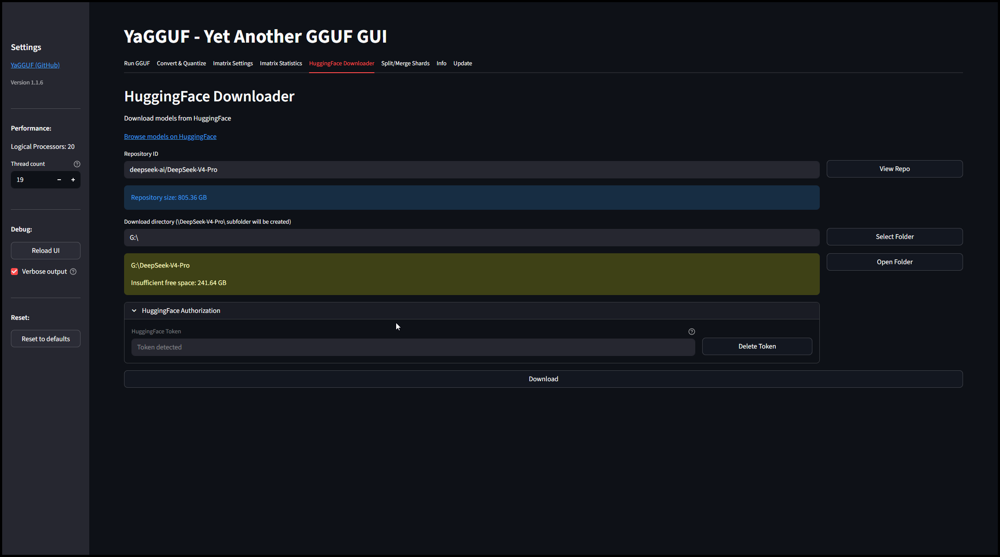

## Split/Merge Shards
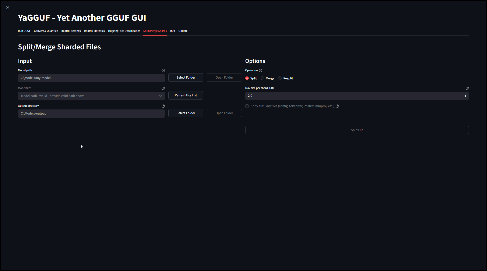

## Resplit Shards
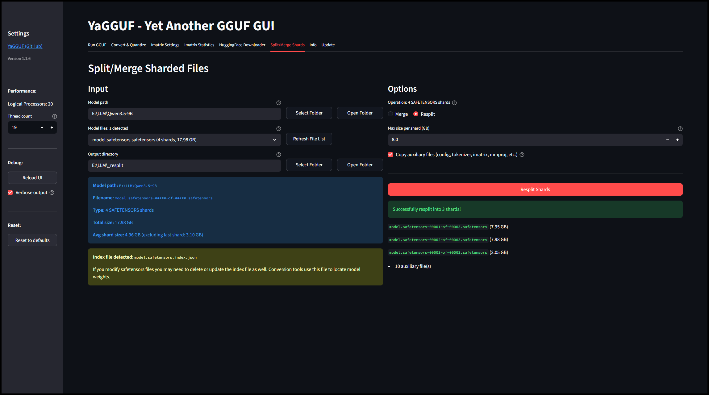

## llama.cpp Custom Installation
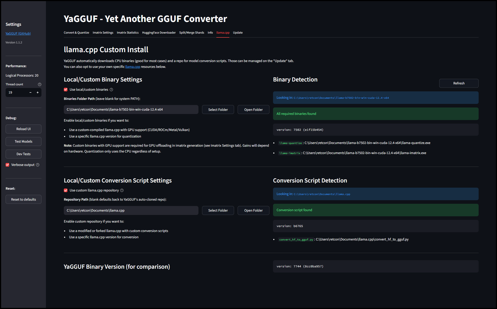

## Update Tab
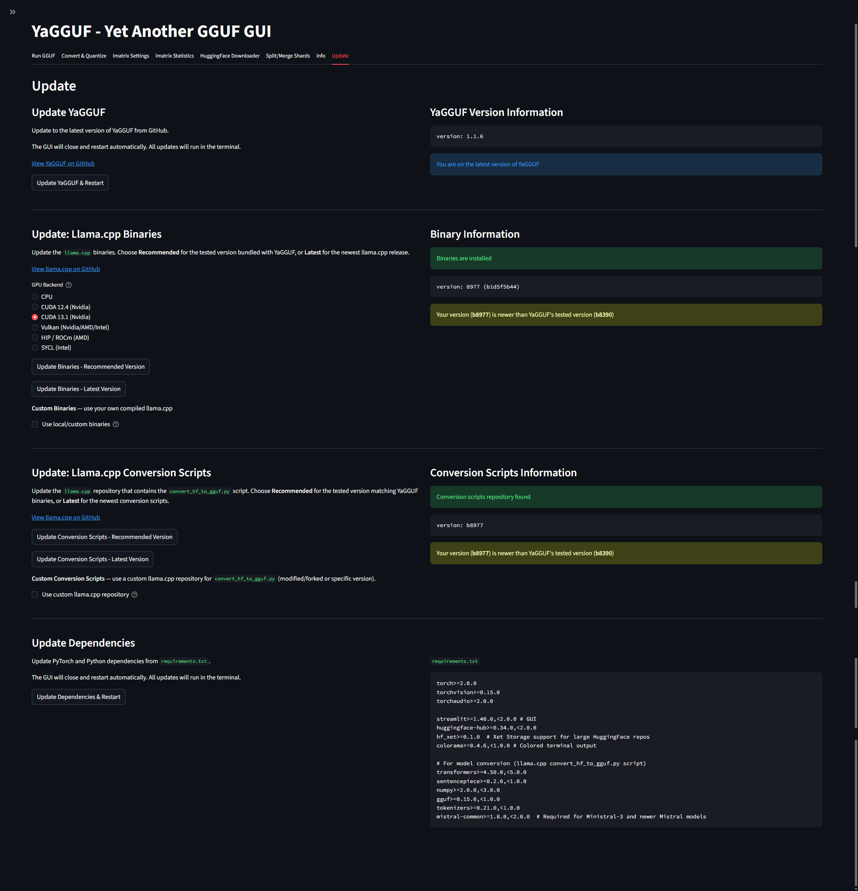

## Terminal Example 1
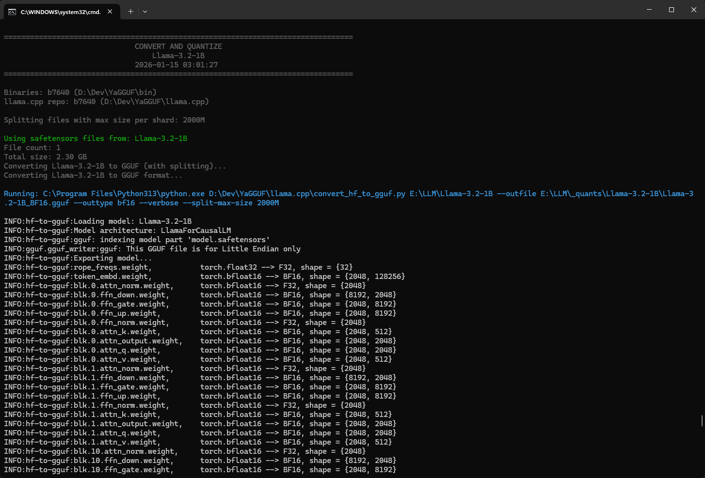

## Terminal Example 2
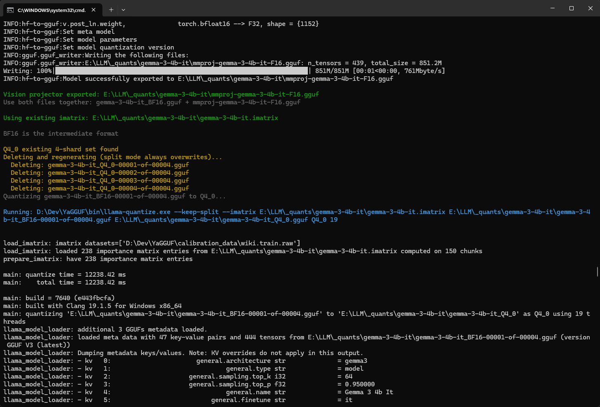